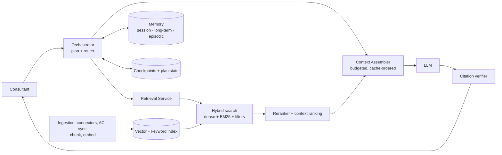

# Context Engineering Architecture Review
### AI Research Assistant for Long-Running Consulting Engagements

**Goal:** a multi-team research assistant that reasons over large, multi-source corpora, keeps context across weeks of work, gives cited and explainable answers, and keeps token cost and latency predictable.

**Design principle:** treat the context window as a scarce, budgeted resource. Each token must earn its place. Durable state lives outside the model (memory stores, plan objects, checkpoints), and the system rebuilds a small, high-signal context on every turn.

---

## 1. Context Engineering Strategy
A **Context Assembler** builds every prompt in a fixed order. Stable content goes first so that prompt caching works, and volatile content goes last.

| Order | Block | Budget (of ~100k usable) | Cached? |
|---|---|---|---|
| 1 | System policy, tool schemas, citation rules | ~4k | Yes |
| 2 | Engagement profile (client, scope, glossary, key decisions) | ~3k | Yes (per engagement) |
| 3 | Current plan + task state | ~2k | No |
| 4 | Relevant long-term and episodic memories | ~3k | No |
| 5 | Retrieved evidence (ranked, with source IDs) | ~25–40k | No |
| 6 | Compacted session summary + last N turns | ~8k | Partial |
| 7 | User query (rewritten + original) | <1k | No |

Before assembly, a small model classifies intent: lookup, synthesis, comparison, or a data question. It also rewrites the query, using session context to resolve pronouns and acronyms. The intent decides which sources are queried and how the token budget is split. Blocks that are not needed are left out, never padded.

## 2. Memory Architecture
| Layer | Holds | Store | Lifetime / write policy |
|---|---|---|---|
| **Working** | Current turn: query, retrieved chunks, tool outputs, scratch reasoning | Context window only | Discarded after the turn; tool outputs are trimmed once used |
| **Session** | Rolling summary, last N turns, open questions | Redis (keyed by user + engagement) | Duration of a session; compacted at thresholds |
| **Long-term (semantic)** | Durable facts: client profile, hypotheses, decisions, user preferences, terminology | Postgres + pgvector, scoped by `engagement_id` | Extracted after each session by an LLM pass. Deduplicated, conflict-checked, timestamped, and stored with provenance and confidence. Users can view and edit it |
| **Episodic** | Records of past tasks: goal, steps, sources used, outcome, user feedback | Postgres (structured) + embeddings | Retrieved by similarity to a new task, so past successful approaches can be reused ("last time we sized this market, we used X") |

Memory is **scoped hierarchically**: user → team → engagement → firm. Cross-engagement memory is opt-in and anonymized. Every memory carries a source pointer so it can be audited or expired.

## 3. Retrieval Architecture
- **Data sources:** SharePoint/Drive deliverables and decks, the firm knowledge base and past case studies, CRM, expert-call transcripts, licensed market data, and the public web. Connectors sync incrementally (content hash + modified time) and **carry document ACLs into index metadata**.
- **Chunking:** structure-aware, not fixed-size.
  - Text is split by heading or section into 400–800 tokens with ~10% overlap.
  - Each slide is one chunk.
  - Tables are kept whole as Markdown and paired with an LLM-written summary.
  - Transcripts are split by speaker turn.
  - **Parent-child chunking:** small chunks are used for matching, and their parent section is returned for context.
  - Each chunk gets a **contextual header** (document title, section path, client, date) before embedding.
- **Embeddings:** a multilingual model for a global firm (e.g., Cohere embed-v3 or OpenAI text-embedding-3-large). The model version is stored with each vector so the index can be re-embedded side by side during migrations. Sparse BM25 vectors are generated alongside the dense ones.
- **Vector storage:** Qdrant, or Pinecone or pgvector at smaller scale. One collection holds both dense and sparse vectors, with payload filters on `tenant`, `engagement_id`, `acl_groups`, `doc_type`, `date`, and `region`. Indexes are HNSW with int8 quantization.
- **Pipeline:** query rewrite → **ACL + metadata pre-filter** → parallel dense + sparse search (top 50 each) → fusion → rerank → context ranking → assembly.

## 4. Retrieval Optimization
- **Hybrid retrieval:** dense search catches paraphrase and meaning. BM25 catches exact terms such as client names, tickers, and product codes. The two result lists are merged with **Reciprocal Rank Fusion**.
- **Reranking:** a cross-encoder (e.g., Cohere Rerank or bge-reranker) rescores about 100 candidates and keeps the top 8–15.
- **Context ranking:** the final score combines the rerank score with recency, source authority (a final deliverable outranks a draft), and **MMR diversity** to remove near-duplicates. The strongest evidence is placed at the start and end of the evidence block, to counter the lost-in-the-middle effect.
- **Source attribution:** each chunk enters the prompt with a stable ID (`[S3]`), and the model must cite IDs inline. A post-generation **citation verifier** checks that each cited claim is supported by its chunk. The UI renders document, page or slide, date, and a link. If the evidence is weak, the assistant says it lacks enough evidence instead of guessing.

## 5. Context Window Management
- **Hard budgets per block**, enforced by the assembler using a tokenizer count, not estimates.
- **Progressive disclosure:** the model first sees summaries and chunk lists, then calls a `fetch_section` tool for depth. Whole documents are never stuffed into the prompt.
- **Hierarchical summaries** are precomputed at ingestion (document → section → chunk). Corpus-wide questions run **map-reduce** over these summaries.
- **Sub-agents with isolated contexts** (e.g., one per source or sub-question) each return a condensed, cited finding, usually 1–2k tokens, rather than raw text.
- **Structured data goes to code.** Large tables and datasets are queried with SQL or Python tools, and only the results enter the context.

## 6. Long-Running Workflow Support
- **Planning persistence:** each research task is a structured plan object (task tree, status, owner, findings, open questions) stored in Postgres. A compact view of it is re-injected every turn, so the agent never depends on chat history to know where it is.
- **External memory:** an **engagement notebook** holds notes, interim findings, and drafts that the agent reads and writes through tools. This is durable working state shared by the team.
- **Checkpointing:** the orchestrator (e.g., LangGraph with a Postgres checkpointer, or Temporal for multi-day jobs) persists state after every step. Tool calls are idempotent, so a crashed or paused run resumes from the last checkpoint, and humans can approve steps in between.
- **Context compaction:**
  - Compaction triggers at about 70% of the budget.
  - Older turns are summarized into a structure of decisions, facts with citations, and open items.
  - Stale tool outputs are cleared.
  - Raw history stays in the log and can be retrieved on demand, so compaction loses nothing permanently.

## 7. Cost & Performance Optimization
| Lever | Effect |
|---|---|
| Prompt caching of the stable prefix (blocks 1–2) | Large input-cost and latency cut on repeat turns |
| Model routing: small model for classification, rewriting, extraction, and summaries; frontier model only for synthesis | Most calls run on the cheap tier |
| Semantic cache for repeated questions (keyed by engagement + ACL) | Skips retrieval and generation entirely |
| Incremental, hash-based re-indexing; embedding cache | Avoids re-embedding unchanged content |
| Metadata pre-filtering + vector quantization | Smaller search space, less memory |
| Tight rerank cut-off (8–15 chunks) | Fewer evidence tokens per call |
| Parallel retrieval, streaming output, async memory writes | Lower p95 latency |
| Batch API for offline ingestion and summarization | Lower unit cost for bulk work |

**Tracked metrics:** tokens and cost per task and per engagement, cache hit rate, p50/p95 latency, and retrieval recall@k. Per-team quotas and budget alerts are enforced at the gateway.

## 8. Risk Assessment
| Risk | Mitigation |
|---|---|
| **Cross-client data leakage** (the top risk for a consultancy) | ACL filtering *before* search, per-engagement memory scope, tenant-isolated caches, audit logs |
| Hallucination / ungrounded claims | Mandatory citations, entailment-based verifier, "insufficient evidence" path |
| Prompt injection via ingested documents or web pages | Retrieved text treated as data, tool permissions limited by role, sanitization, human approval for outbound actions |
| Memory poisoning or stale memories | Provenance, confidence, timestamps, TTLs, user-editable memory, conflict detection |
| Context drift over weeks | Re-injected plan state, structured compaction, periodic summary refresh |
| Stale or conflicting sources | Recency weighting, surfacing conflicts to the user, sync monitoring |
| Cost overruns | Budgets, routing, caching, quotas, per-task cost telemetry |
| Embedding or model upgrades | Versioned vectors, shadow re-indexing, golden-set regression tests |
| Quality regression | Offline evaluation (faithfulness, answer relevance, context precision/recall) on golden sets, plus online feedback |

**Scalability:** the assembler, retrieval, and orchestrator services are stateless and scale horizontally, with all state kept in Redis, Postgres, and the vector store. Vector collections are sharded by tenant or region to meet data-residency rules, and ingestion runs as a queue-driven worker pool.
