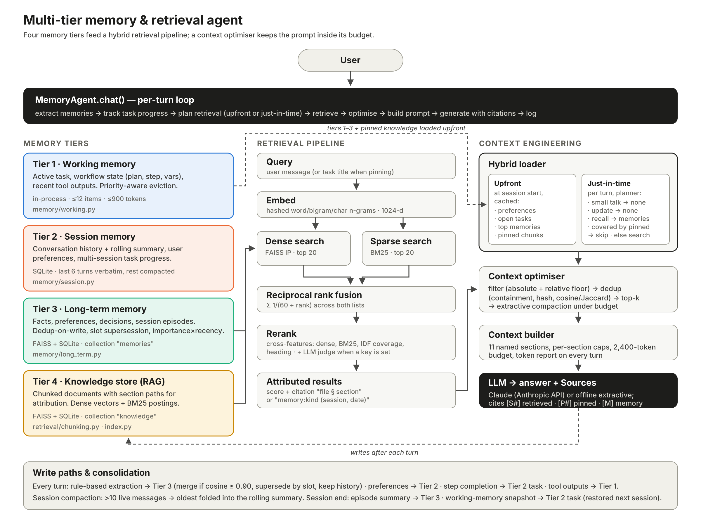

# Memory design

The agent separates memory by **lifetime** and **cost of carrying it in the prompt**. Short-lived,
always-present state is kept tiny; long-lived knowledge is never carried wholesale and is instead
retrieved when needed. Every tunable number below lives in [`memagent/config.py`](../memagent/config.py).

| Tier | Holds | Lifetime | Storage | How it reaches the prompt | Code |
|---|---|---|---|---|---|
| 1. Working memory | active task, workflow state (plan, current step, variables), recent tool outputs and observations | one task | in-process; checkpointed into the task at session end | always rendered (≤ 900 tokens) | [`memory/working.py`](../memagent/memory/working.py) |
| 2. Session memory | full conversation history, rolling summary, user preferences, multi-session task progress | one session (history) / indefinite (prefs, tasks) | SQLite `session.sqlite` | summary + last 6 turns; prefs and task progress loaded upfront | [`memory/session.py`](../memagent/memory/session.py) |
| 3. Long-term memory | facts, preferences, decisions about the user and the work; one episode summary per session | indefinite, decays in ranking | FAISS + SQLite, collection `memories` | top memories upfront; more via just-in-time recall | [`memory/long_term.py`](../memagent/memory/long_term.py) |
| 4. Knowledge store (RAG) | chunked documentation corpus | until re-ingested | FAISS + SQLite + BM25, collection `knowledge` | pinned chunks upfront; just-in-time hybrid search | [`retrieval/`](../memagent/retrieval) |



## Tier 1 — Working memory

Scratch space for the task in progress.

- **Contents.** `active_task` (the goal), `workflow_state` (`plan`, `step`, `status`, `vars`) and a deque of
  `WMItem`s (`tool_output`, `observation`, `note`), each with a source and a priority.
- **Writes.** The agent logs every tool call it makes as a `tool_output` (`search_knowledge`, `recall_memory`)
  and every completed task step as an `observation`.
- **Bounds.** At most 12 items and 900 tokens. Each item is clipped to 220 tokens on entry, so one huge tool
  result cannot flood the tier. When a bound is exceeded the item with the lowest `(priority, timestamp)` is
  evicted — low-priority and old first; priority-2 items are effectively pinned for the task.
- **Persistence.** Working memory is process-local by design, but at session end its snapshot is written into the
  open task row (tier 2). The next session restores it (`WorkingMemory.restore`), so an interrupted workflow resumes
  with its plan position and recent observations intact. `complete_task()` clears the tier.

## Tier 2 — Session memory

SQLite tables (`users`, `sessions`, `messages`, `tasks`) give continuity across turns and across sessions.

- **History.** Every message is stored with its token count and is never deleted.
- **Compaction.** When more than `session_compact_after = 10` un-summarised messages exist, everything except the
  most recent `session_recent_turns = 6` is summarised by the LLM into `sessions.summary` (the previous summary is
  fed back in, so it *rolls*), and those rows are flagged `compacted = 1`. The prompt therefore carries
  *summary + 6 recent turns* no matter how long the session runs. In the evaluation scenario compaction fired three
  times and removed 364 tokens of history from the prompt.
- **Preferences.** Key/value per user (`language`, `style`, …), last write wins. Written immediately when the
  extractor finds a preference, so the very next turn respects it.
- **Tasks.** A task has a title, ordered steps with `done` flags and notes, a status, and the last working-memory
  snapshot. Steps are completed explicitly (`complete_step`) or from natural language: "finished / completed /
  done with X" is fuzzy-matched (sequence ratio or token overlap ≥ 0.5) against open step names. Questions are
  never treated as completions ("did we finish X?").
- **Session end.** The remaining live turns plus the rolling summary are summarised into a final session summary,
  which is shown to future sessions under *Previous sessions*.

## Tier 3 — Long-term memory

Durable knowledge *about the user and the work*, stored as embedded records in the `memories` collection.

**Record schema** (`meta` JSON beside each vector):

```json
{"user_id": "priya", "kind": "preference", "importance": 0.8, "slot": "pref:language",
 "created_at": "...", "updated_at": "...", "last_accessed": "...", "access_count": 2,
 "session_id": "s-3bdb7882", "history": [{"text": "User prefers Python examples", "until": "..."}]}
```

`kind` is one of `fact`, `preference`, `decision`, `episode`.

**Write path.** Each user message runs through `extract_memories()`, a deterministic rule set that recognises
names, preferences ("I prefer…", "keep answers…"), decisions ("we decided…", "let's go with…"), explicit
"remember that…", deadlines, the current project, the stack and the region. Rules were chosen over an LLM
extractor so writes are reproducible and testable; an LLM pass can be layered on top. Writes go through three
quality gates:

1. **Slot supersession.** Facts that can only have one current value carry a `slot` (`pref:language`,
   `project:deadline`, `project:region`…). A new value for a slot *replaces* the text in place and appends the
   old value to `history`. This is what stops "prefers Python" from being returned after the user said "I prefer
   Go from now on" — the evaluation measures a 0% stale-value rate.
2. **Semantic de-duplication.** Otherwise, if an existing memory of the same user has cosine similarity
   ≥ 0.90, the new one is merged: `access_count` and `importance` go up, no second record is stored.
3. **Importance.** Each rule assigns an importance (0.7–0.9; episodes 0.6) used in ranking.

**Read path.** Memories are retrieved with the same hybrid pipeline as documents, filtered to the current user,
then multiplied by a prior `importance × (0.5 + 0.5 × recency)`, where recency halves every 30 days. Old,
unimportant memories therefore fade from the top ranks without ever being deleted. Retrieved memories have their
`access_count` and `last_accessed` updated.

**Consolidation.** At session end an *episode* memory ("Session s-…: summary") is written, so later sessions can
recall what happened even when no individual fact was extracted.

## Tier 4 — Knowledge store

The document corpus the agent answers from. Its construction (chunking, embedding, indexing) and the search over
it are described in [retrieval_pipeline.md](retrieval_pipeline.md). It lives in the same `LongTermMemory`
object as tier 3 because both are persistent vector collections over one embedder, but it has a different
writer (ingestion rather than conversation) and different read rules (no per-user filter, no recency decay).

## The hybrid loading strategy

Context comes from two paths, decided per session and per turn.

**Upfront (once per session, cached).** `start_session()` loads, before the user says anything:

- preferences and open tasks from tier 2, and the working-memory snapshot of the most recent task (tier 1);
- the summaries of the previous two sessions;
- the six highest-prior facts, preferences and decisions from tier 3;
- **pinned knowledge:** the knowledge chunks most relevant to the open task's *next step* (retrieved with the
  task title and next step as the query, kept to 2 chunks / 450 tokens).

The cache is refreshed whenever the agent changes something it contains (a memory write, a completed step).
Stable, high-prior context is thus paid for once, not re-searched every turn.

**Just-in-time (per turn).** `plan_retrieval()` classifies the message:

| Message | Plan |
|---|---|
| small talk ("thanks") | no retrieval |
| statement that only produced memory writes or step completions | no retrieval — acknowledge |
| pure recall ("where did we leave off?", "what's next?") | memories only; answer from task progress |
| question already covered by pinned knowledge (score ≥ 0.55 and ≥ 60% IDF-weighted term coverage) | knowledge search **skipped** |
| any other question | hybrid knowledge search (+ memory search if it contains a memory cue) |

In the three-session evaluation scenario, 19 user turns needed only 4 knowledge searches: 3 questions were
answered from pinned upfront context and 12 turns needed no knowledge retrieval at all
([metrics](metrics.md#5-context-efficiency-and-the-hybrid-strategy-scenario-run)).

## Context optimisation

Everything competing for the prompt goes through `ContextOptimizer`
([`context/optimizer.py`](../memagent/context/optimizer.py)):

1. **Filtering.** Drop candidates below `max(0.20, 0.5 × best score)` and any candidate that covers none of the
   query's terms. The relative floor is what lifts context precision from 46% to 74% on the eval set with no loss
   of answer support.
2. **De-duplication.** (a) *containment* — a chunk whose content words are ≥ 85% contained in a longer candidate is
   dropped and the longer one inherits the higher score (catches FAQ answers copied from guides); (b) exact
   duplicates by normalised content hash; (c) near-duplicates by cosine ≥ 0.85 or token Jaccard ≥ 0.7. Candidates
   are also de-duplicated against what is already loaded upfront, so a pinned chunk is never repeated as a
   retrieved one.
3. **Selection.** Keep the best `final_k = 4`.
4. **Compaction.** If the survivors exceed the token budget, each is reduced to its most query-relevant sentences
   (extractive, so citations stay faithful to the source wording); if still over budget, the lowest-ranked items
   are dropped. Conversation history is compacted separately by tier 2's rolling summary.

The `ContextBuilder` then assembles named sections with per-section caps under a 2,400-token budget and returns a
per-section token count on every turn (visible in each turn's `trace["context_tokens"]`).

## Failure modes and how they are handled

| Risk | Mitigation |
|---|---|
| Prompt grows with session length | rolling summary + fixed recent-turn window; per-section caps |
| Contradictory memories after the user changes their mind | slot supersession with history |
| Same fact stored many times | cosine dedup on write (0 duplicate pairs in the eval) |
| Stale memories crowd out fresh ones | importance × recency prior on read |
| A huge tool output floods the prompt | per-item clip and token-budgeted eviction in working memory |
| Retrieved text repeats what is already in context | dedup against upfront context |
| Answer without support | grounding instructions, relevance floor, explicit "I don't have grounded information" fallback |
