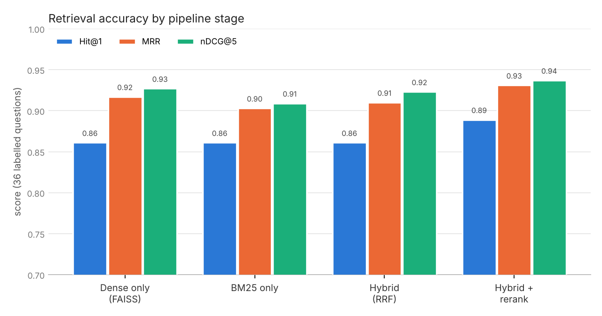

# Performance metrics

Produced by `python scripts/run_eval.py` with embedder `hashing-ngram-v1` and generator `offline-extractive` over 46 indexed chunks. All numbers are regenerated from scratch on every run (fresh stores) and are deterministic in offline mode. Raw output: [`results/metrics.json`](../results/metrics.json).

## Headline

| Metric | Value |
|---|---|
| Retrieval Hit@1 (hybrid + rerank) | **88.9%** |
| Retrieval Recall@5 | **97.2%** |
| MRR | **0.931** |
| Context precision after optimisation | **72.5%** |
| Answer support (final context contains the answer) | **97.2%** |
| Retrieved-context token reduction | **83.3%** |
| Long-term memory fact recall@3 (fresh agent, after 3 sessions) | **100.0%** |
| Stale value returned after a preference changed | **0.0%** |
| Response consistency — same question, new session | **100.0%** correct in both |
| Response consistency — paraphrased question, new session | **91.7%** correct in both |
| Cross-session continuity checks passed | **100.0%** (6 checks) |

## 1. Retrieval accuracy

36 hand-labelled questions (`data/eval/retrieval_qa.json`), each with the gold document section(s) that answer it. Most questions are paraphrased so they do not copy the source wording. A result counts as relevant when its source file and section match a gold label.

| Pipeline | Hit@1 | Hit@3 | Recall@5 | MRR | nDCG@5 |
|---|---|---|---|---|---|
| Dense only (FAISS) | 0.861 | 0.972 | 0.972 | 0.917 | 0.927 |
| BM25 only | 0.861 | 0.944 | 0.944 | 0.903 | 0.909 |
| Hybrid (RRF fusion) | 0.861 | 0.944 | 0.972 | 0.910 | 0.923 |
| Hybrid + rerank (shipped) | 0.889 | 0.972 | 0.972 | 0.931 | 0.937 |

Questions where the top-1 result was not a gold section:

- `q02` *What percentage of traffic goes to the canary and for how long?* → top-1 was `migration_guide.md § Step 6: Canary launch`
- `q09` *How do I recover a database to an earlier point in time?* → top-1 was `migration_guide.md § Step 4: Database migration`
- `q10` *What pattern must schema changes follow so rollbacks stay safe?* → top-1 was `deployments.md § Rollback`
- `q13` *Where do I store API keys and passwords for my service?* → top-1 was `migration_guide.md § Regions and data residency`

Reading: on this small corpus dense and sparse retrieval are individually strong and share only 3 of their 5 top-1 misses; RRF fusion alone mostly averages them, and the cross-feature reranker (which scores query and passage jointly — IDF-weighted term coverage, heading match, dense and sparse evidence) is what lifts Hit@1 and MRR. With `ANTHROPIC_API_KEY` set the reranker additionally blends in an LLM relevance judgement.

## 2. Context relevance and optimisation

For every QA question the reranked candidates go through the context optimiser (filter → dedup → select → compact) exactly as in a chat turn.

| Optimiser stages | Context precision | Answer support | Chunks kept | Tokens kept |
|---|---|---|---|---|
| raw top-k (no optimisation) | 28.5% | 97.2% | 3.89 | 193 |
| + absolute floor | 46.1% | 97.2% | 3.03 | 153 |
| + relative floor | 73.6% | 97.2% | 2.00 | 102 |
| + dedup (full pipeline) | 72.5% | 97.2% | 1.97 | 101 |

- The relative floor does most of the work: it drops candidates that are much weaker than the best one without losing a single answer. Dedup slightly *lowers* the precision number: on the rollback and Friday-deploy questions the FAQ copy and the guide section were *both* labelled gold, so removing the redundant FAQ copy removes a gold-labelled chunk even though no information is lost. Its job is to stop the same text reaching the prompt twice, not to raise precision.
- Relevance floor calibration: with the absolute floor at 0.2, 100.0% of gold candidates are kept and 72.3% of non-gold candidates are filtered (mean reranker score: gold 0.659, non-gold 0.147).
- Deduplication fired on 2 of 36 queries in the full pipeline (2 redundant chunks removed — mostly FAQ answers contained in the main guides).
- Compaction stress test (budget squeezed to 90 tokens): 32 chunks were compacted to their most query-relevant sentences, keeping answer support at 91.7% with 62 tokens per query on average.

## 3. Memory quality

After the three-session scenario, a brand-new agent instance probes long-term memory (only the on-disk stores are shared).

| Metric | Value |
|---|---|
| Fact recall@3 over 7 probes | 100.0% |
| Stale-value rate (old preference returned after supersession) | 0.0% |
| Stored fact/preference/decision memories | 8 |
| Memory precision (stored memories that are expected facts) | 100.0% |
| Near-duplicate memory pairs (cosine ≥ dedup threshold) | 0 |
| Memories superseded with history kept | 1 |
| Episode memories (one per session) | 3 |

| Probe | Expected | Found in top-3 |
|---|---|---|
| What is the user's name? | Priya | yes |
| Which region does the user deploy to? | eu-west-1 | yes |
| Which programming language does the user prefer for examples? | Go | yes |
| What did we decide about the database migration? | logical replication | yes |
| What is the project deadline? | November 14 | yes |
| Which service is the user migrating? | orders-api | yes |
| How should answers be formatted for this user? | concise | yes |

## 4. Response consistency

12 questions are asked in one session; a **new agent instance** in a **new session** then asks the same question again and a paraphrase of it.

| Variant | Keyword agreement | Correct in both | Cited-source Jaccard | Answer similarity |
|---|---|---|---|---|
| repeat | 100.0% | 100.0% | 1.00 | 1.00 |
| paraphrase | 91.7% | 91.7% | 0.74 | 0.76 |

Repeat consistency is total because retrieval is deterministic and memory does not drift between sessions. Paraphrases still reach the same answer in most cases, but often cite a different (equally valid) section — e.g. the FAQ instead of the guide — which is why source Jaccard is lower than keyword agreement.

### Cross-session continuity checks

| Check | Session | Turn | Passed |
|---|---|---|---|
| Session 2 resumes at the right next step | 2 | *Hey, where did we leave off?* | yes |
| Completed step from session 1 is visible in session 2 | 2 | *Hey, where did we leave off?* | yes |
| Region fact from session 1 is loaded upfront in session 2 | 2 | *Hey, where did we leave off?* | yes |
| Superseded preference (Go) is what session 3 sees | 3 | *What do you remember about me and this project?* | yes |
| Decision from session 1 is recalled in session 3 | 3 | *What did we decide for the database move?* | yes |
| Session 3 knows the next step after three sessions of progress | 3 | *What's the next step?* | yes |

## 5. Context efficiency and the hybrid strategy (scenario run)

| Metric | Value |
|---|---|
| User turns | 19 |
| Turns that needed a just-in-time knowledge search | 4 |
| Turns answered from pinned upfront knowledge (JIT skipped) | 3 |
| Turns needing no knowledge retrieval (memory updates, recall) | 12 |
| Upfront context per session (tokens) | 0, 323, 471 |
| Mean / max prompt size (tokens) | 680.5 / 999 (budget 2400) |
| Session compactions / tokens saved | 3 / 364 |
| Mean turn latency (offline) | 11.6 ms |

## Limitations

- The default embedder is an offline hashed n-gram model, chosen so the project runs anywhere with no downloads; swapping in `sentence-transformers` (`MEMAGENT_EMBEDDER=sentence-transformers`) is a one-line change.
- The QA set is small (36 questions over 9 documents) and was written by the same author as the corpus, so absolute numbers are optimistic; the ablation *differences* are the more meaningful signal.
- Offline answers are extractive. Response-consistency numbers with a real LLM will differ and can be measured with `--llm anthropic`.
